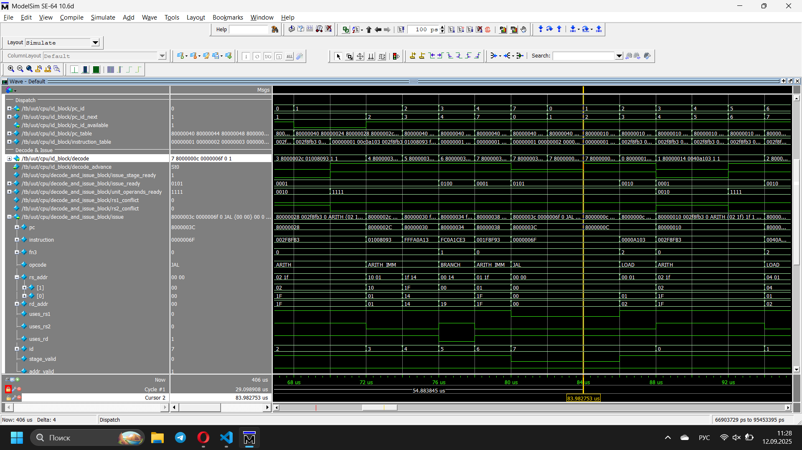

Требования к содержанию отчета

1. Титульный лист

2. Цели работы, основные теоретические сведения

3. Исходный текст исследуемой программы, дизассемблерный листинг, псевдокод, поясняющий работу программы.

4. Скриншоты, полученные в ходе выполнения заданий №2, №3, №4.

5. Трассу работы программы (поместить в отчет и приложить к отчету в виде файла-приложения).

6. Временные диаграммы (в виде скриншотов окна Modelsim) сигналов, соответствующих всем стадиям выполнения команды, обозначенной в тексте программы символом #!.

7. Вывод об эффективности работы программы, предложения по ее оптимизации.

8. Исходный текст и дизассемблерный листинг оптимизированной программы.

9. Трассу работы оптимизированной программы (поместить в отчет и приложить к отчету в виде приложения).

10. Выводы.

# Вариант 9

# 3.1 Исходный текст
```
.section .text
        .globl _start;
        len = 8 #Размер массива
        enroll = 4 #Количество обрабатываемых элементов за одну итерацию
    elem_sz = 4 #Размер одного элемента массива

_start:
        addi x20, x0, len/enroll
        la x1, _x
    add x31, x0, x0
lp:
        lw x2, 0(x1)
        add x31, x31, x2 #!
        lw x3, 4(x1)
        add x31, x31, x3
        lw x4, 8(x1)
        lw x5, 12(x1)
        add x31, x31, x4
        add x31, x31, x5
        addi x1, x1, elem_sz*enroll
        addi x20, x20, -1
        bne x20, x0, lp
        addi x31, x31, 1
lp2: j lp2

.section .data
_x:     .4byte 0x1
        .4byte 0x2
        .4byte 0x3
        .4byte 0x4
        .4byte 0x5
        .4byte 0x6
        .4byte 0x7
        .4byte 0x8
```
# 3.2 Дизассемблерный листинг
```
Disassembly of section .text:

80000000 <_start>:
80000000:       00200a13                addi    x20,x0,2
80000004:       00000097                auipc   x1,0x0
80000008:       04008093                addi    x1,x1,64 # 80000044 <_x>
8000000c:       00000fb3                add     x31,x0,x0

80000010 <lp>:
80000010:       0000a103                lw      x2,0(x1)
80000014:       002f8fb3                add     x31,x31,x2
80000018:       0040a183                lw      x3,4(x1)
8000001c:       003f8fb3                add     x31,x31,x3
80000020:       0080a203                lw      x4,8(x1)
80000024:       00c0a283                lw      x5,12(x1)
80000028:       004f8fb3                add     x31,x31,x4
8000002c:       005f8fb3                add     x31,x31,x5
80000030:       01008093                addi    x1,x1,16
80000034:       fffa0a13                addi    x20,x20,-1
80000038:       fc0a1ce3                bne     x20,x0,80000010 <lp>
8000003c:       001f8f93                addi    x31,x31,1

80000040 <lp2>:
80000040:       0000006f                jal     x0,80000040 <lp2>

Disassembly of section .data:

80000044 <_x>:
80000044:       0001                    .insn   2, 0x0001
80000046:       0000                    .insn   2, 0x
80000048:       0002                    .insn   2, 0x0002
8000004a:       0000                    .insn   2, 0x
8000004c:       00000003                lb      x0,0(x0) # 0 <elem_sz-0x4>
80000050:       0004                    .insn   2, 0x0004
80000052:       0000                    .insn   2, 0x
80000054:       0005                    .insn   2, 0x0005
80000056:       0000                    .insn   2, 0x
80000058:       0006                    .insn   2, 0x0006
8000005a:       0000                    .insn   2, 0x
8000005c:       00000007                .insn   4, 0x0007
80000060:       0008                    .insn   2, 0x0008
```
# 3.3 Псевдокод
```
#define len 8 # array size
#define enroll 4 # number of elements in iteration
#define elem_sz 4 # element size

int _x[]={1,2,3,4,5,6,7,8};

void _start() {
    int x20 = len/enroll;
    int *x1 = _x;
    int x31 = 0;

    do {
    int x2 = x1[0];
    x31 += x2;
    int x3 = x1[1];
    x31 += x3;
    int x4 = x1[2];
    int x5 = x2[3];
    x31 += x4;
    x31 += x5;
    x1 += elem_sz*enroll;
    x20--;
    } while(x20 != 0);
    
    x31++;
    while(1){}
}
```
- После выполнения программы в регистре x31 будет содержаться сумма всех элементов массива + 1, равная 37.

# 4.1 Задание 2

- Снимок экрана, содержащий временную диаграмму выполнения стадий выборки и диспетчеризации команды с *адресом 8000002с, 1-я итерация цикла*, в который входит команда.


# 4.2 Задание 3

- Снимок экрана, содержащий временную диаграмму выполнения стадии декодирования и планирования на выполнение команды с *адресом 8000000с, 2-я итерация цикла*, в который входит команда.



# 4.3 Задание 4

- Снимок экрана, содержащий временную диаграмму выполнения стадии выполнения команды с *адресом 80000020, 1-я итерация цикла*, в который входит команда.


# Задание 5

- Результат работы программы в регистре x31.


- Строка из вывода дизассемблера, содержащая адрес команды, для которой необходимо на временной диаграмме найти все стадии выполнения 
```
80000014:       002f8fb3                add     x31,x31,x2
```
- Выборка, диспетчеризация, декодирование и планирование на выполнение


- Выполнение 


